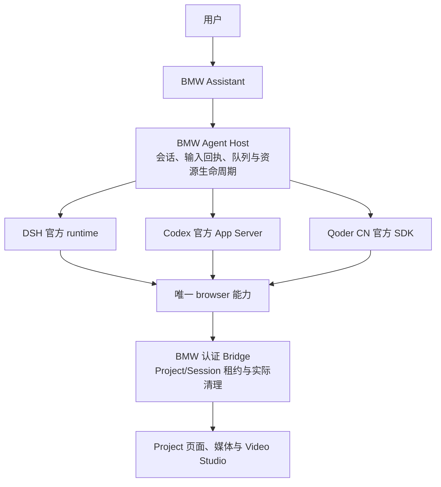

# BMW 多 Agent 设计

## 产品形态

保留一个 BMW 应用和一套 Project、浏览器、媒体及 Video Studio。BMW 提供自己的 Assistant 对话面板，DSH、Codex、Qoder CN 是可选择的执行引擎。用户在 BMW 新建会话、发送消息、查看回复和工具进度、停止与续聊，不依赖 SDK 会话出现在原生桌面侧边栏。

Qoder SDK / Codex App Server 的会话与它们桌面应用的对话列表分开验证。原生桌面打开/同步只在有公开接口并通过实际验收时启用，不作为 BMW 的运行条件。WorkBuddy 暂不纳入。

## 责任与接口

| 部分 | 责任 |
|---|---|
| BMW UI | 对话列表、消息、运行状态、权限提示、停止、Studio 上下文 |
| agent-contract | Session、请求/事件/回执、驱动能力和生命周期的具名契约 |
| BMW Host | 持久化后提交输入、验证成员关系、全局 FIFO、取消和实际清理 |
| 三个 harness | 官方引擎启动、正常认证、模型配置、原生恢复和协议事件转换 |
| browser / Bridge | 唯一模型能力、参数验证、租约、Project 排除、截图及媒体准入 |
| Project / Studio | 页面、素材、草稿、版本冲突与输出记录 |

BMW Host 不实现模型循环。引擎规划下一步并调用工具；BMW 只接收已验证的 `browser` 动作。Agent 到 BMW 可使用 MCP，或 Codex 官方 dynamic tool 回调经同一 Bridge 转发。会话创建/恢复属于引擎控制接口，不把额外会话管理工具添加给模型。

## 会话与共享资源

BMW Session 是稳定的产品身份，固定 Project 与 driver；provider Session ID 是不可替换的原生续聊锚点。先创建可见空会话，第一次发送时再连接引擎。DSH 旧 ID 原样导入，使已有 Studio owner 和计划任务引用保持有效。

切换引擎选择该引擎在同一 Project 中的会话，没有则创建空会话。不同引擎共享 Project 页面和媒体，但保留各自原生上下文。显示历史可以展示或导出；不能把拼接文本当作另一个引擎的原生恢复。Studio 草稿保持原有 Session 归属和修订规则。

输入先写 BMW 消息和回执，再提交官方引擎。接受、完成、失败、取消与结果未知分开记录。模型完成后还要等待真实浏览器/媒体和原生进程清理；清理失败保持资源隔离，恢复只重试清理。重启或断连不自动重发结果未知的输入。

## 工具、认证与能力门槛

发送用户输入前验证实际模型可见目录恰好只有 BMW `browser`；每次模型调用也必须保持该边界。提示词、工具拒绝回调和 skill 都不能代替有效目录验证。模型或引擎版本变化后重新验证，失败时禁用该组合。

各驱动使用独立配置和官方正常登录流程，不读取原生桌面的私有凭据。GUI 切换驱动自动读取认证，缺少凭据时显示登录方式和驱动切换入口；登录后只显示维护的支持名单与官方目录交集，点选确认保存模型。设置不产生模型推理，也不要求用户单独验证：Codex 的专项工具预检在实际输入前执行；Qoder 冷控制会话仍内部检查 SDK 初始化目录。每个引擎实际输入前继续要求有效目录唯一 browser。fork、steer、Agent 审批、原生桌面打开等按实际能力启用，未验证功能禁用。

`qoder-bmw` 是官方 SDK 适配器及复用 skill 操作指导，见 [接入说明](QODER_BMW.md)。BMW Host 管理短期连接；不把长期 token 和临时 binding 写入全局 MCP 设置。

## 调度与迁移

每个计划任务固定 Project、BMW Session 与 driver。绑定失效时记录失败，要求用户显式修复，不能改为当前会话或另一个引擎。排队/运行时禁止重绑，执行遵循同一资源队列和 Studio 修订保护。

保留旧 DSH UI 直至新 UI 在所需能力上等效。迁移通过官方协议读取旧会话和显示历史，保存原有 Project/Workspace/Session 与媒体身份。先在隔离副本验收，再按修改前清单合并本次增量，保护原仓库已有改动。

## 验收与当前证据

三个引擎分别验收：只暴露 browser、真实页面操作、真实截图读图、正确 Studio owner/版本、关闭原生进程后同一 Session 续聊、取消及清理、跨 Project 拒绝、计划任务固定绑定，以及损坏保存数据的重试/退出。

三驱动默认入口、登录/模型设置、跨进程恢复与固定调度已实现并验收。Codex App Server 0.160.0 通过官方启动模型目录投影，为 GPT-6.1 Sol、GPT-6 Astra、GPT-6 Sol 和 GPT-6 Luna 提供直接 browser 调用；保留原模型身份、原生传输和能力，并以实际有效目录继续要求唯一工具。四个型号与 GPT-5.5 均完成两轮真实截图、Studio 和原生续聊验收。新增未知型号不自动获得准入，账号列表也不证明推理可用性。当前源码、受保护合入及验证记录见 [实施状态](AGENT_DRIVERS_IMPLEMENTATION.md)。

官方接口参考：[Codex App Server](https://learn.chatgpt.com/docs/app-server)、[Qoder SDK 会话控制](https://docs.qoder.cn/cli/sdk/session-control)、[Qoder SDK MCP](https://docs.qoder.cn/cli/sdk/mcp)。
