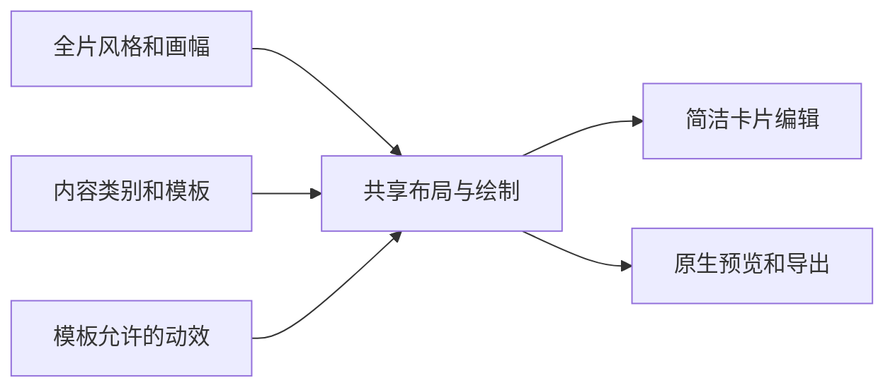

# BMW 简洁卡片模板体系设计

日期：2026-10-09。状态：第一批已有实现与 45 秒八类样片，解锁后的原生卡片交互与窗口布局检查通过；后续批次仍为提案。当前能力以 FUNCTIONAL_SPEC 为准，样片证据见 ../template-sample/source-plan.json。本方案替代前版仅有资讯素材卡和数字卡的范围，保留简洁卡片内展开的编辑方向。

本轮追加了 [每秒两帧调研](DENSE_RESEARCH.md) 与 [设计增量](DENSE_DESIGN.md)：265 个实际样本全部复核。新增模板仍为提案；本轮不修改已交付应用。新增优先级、字段和验收以设计增量为准，原先分批规划作为背景保留。

建议建立八类内容卡，采用“全片风格＋卡片模板＋动效预设”。模型和用户选相同类别、填相同内容槽；位置、字体、层次和大部分时序由模板承担。模板目录、参数校验、编辑控件和预览样例共同来源于一份受信任定义，让更多画面组合来自有限规则，而不是更多自由编辑参数。

## 参考视频实际分类

媒体信息见 [参考分析](DESIGN.md)。早期补充 [每约四秒的全片抽样](classification-sheet.jpg)，现已有覆盖全片的 [每秒两帧复核](DENSE_RESEARCH.md)；早期定位另在 0、4、8、40、44、48、52、56、112、116 秒请求重点帧。单帧文件名是请求时间，不是精确剪辑边界。没有整段核听、完整切点清单或词级时标，因此不据此声明完整镜头数量、声音特点与精确同步。

| 观察类型 | 参考位置及内容 | BMW 映射 | 观察范围 |
|---|---|---|---|
| 全片栏目包装 | 抽样中持续出现三行标题、深灰背景、中心素材和下方字幕 | 全片资讯风格 | 三行标题不等于三要点，也不是每卡重复创建的标题卡 |
| 数字强调 | [4 秒](frame-004.jpg) 的“722篇”；开头连续样本中数字变化 | 数字卡＋静态/计数预设 | 计数曲线未逐帧标定 |
| 文档/帖子证据 | [8 秒](frame-008.jpg)、[48 秒](frame-048.jpg) 文档页面；[112 秒](frame-112.jpg) 黑底反白段落 | 证据卡＋截屏/引用变体 | 成片不能证明标记是在网页还是剪辑里生成 |
| 数学图解与范围对照 | [40 秒](frame-040.jpg) 的 π、箭头；[52 秒](frame-052.jpg)、[56 秒](frame-056.jpg) 的区间和阈值 | 图解卡＋有限推近 | 图中的比较关系不等于原片使用了两项对比模板 |
| 动态主体素材 | 开头光环/飞纸；其他抽样中的人物、工业设备、主题短片 | 素材卡 | 这是素材内容，一个通用“动效卡”不能生成所有这些画面 |
| 人物叠加及身份 | [116 秒](frame-116.jpg) 文档背景叠加人物和姓名 | 固定人物变体或预合成素材 | 独立编辑人物需要新的受限槽 |
| 文档取景变化 | 文档/图解连续样本中的显示范围变化 | 证据/图解卡＋聚焦/推近 | 无法仅凭成片区分录屏、截图动画或其他剪辑 |
| 独立标题、三要点、录屏点击轨迹 | 当前抽样没有充分证据 | 通用扩展模板 | 纳入 BMW 目录，但不宣称原视频使用过 |


参考中的数学判断不作为模板真值。数字、引用和图解关系仍需自己的真实来源；模板保证表达结构与可渲染性，不赋予事实核查状态。

## 分类原则

按“要表达什么”定义类别，按“怎样出现”定义动效，按“整部作品怎样看”定义风格。数字计数、要点揭示、截图聚焦都可以动态表现，不为它们另外建立重复的动效类别。



正常创作只要求选择模板、填写内容，动效使用默认推荐值；用户在折叠的“表现方式”中调整。模型不必设计坐标、字体、曲线和 zIndex。一级目录固定八类，首批每类一个基础模板，后续高频变体留在原类别下面。

横竖屏适配属于同一模板，例如对比卡横屏左右、窄竖屏上下排列。全片资讯布局定义固定标题/品牌/内容/字幕区域，标准布局用于标题、教学和总结。首批以 16:9 与 9:16 验收；其他现有画幅通过真实排版后才公布为模板支持范围。

## 八类基础模板

“现有基础”不代表新目录已经实现。统一目录能先接入旧能力，再逐类扩展有界画面。

| 类别与稳定 ID | 适用目的和内容槽 | 默认表现 | 现有基础及改动 |
|---|---|---|---|
| 标题 `title/basic` | 开场、章节、结尾；标题、可选副标题 | 静态/短淡入 | 复用标题、文字编辑；新增独立标题版式 |
| 要点 `points/three` | 并列结论；标题、恰好三条要点 | 三项同时显示 | 复用 summary 与板书句锚点，接入统一目录 |
| 对比 `comparison/two` | 两个方案/观点/前后状态；标题、两个同维度项 | 同时显示 | 复用 comparison；首版纯文字、两项，不承诺多列图表 |
| 数字 `metric/hero` | 突出一个数量；数值、单位、短说明、可选背景 | 静态大数字 | 新增受限数字绘制与计数 |
| 证据 `evidence/screenshot` | 展示报道/文档/帖子；画面、短说明、来源、可选重点 | 原画面/聚焦 | 复用 screenshot、source、annotate、crop/focus；新增可编辑重点需有界字段 |
| 演示 `demo/recording` | 页面操作；视频、真实源区间、可选重点 | 原视频 | 复用录制事件和 suggest-focus；没有连续光标轨迹 |
| 图解 `diagram/image` | 原理/关系/位置/范围；图像、短说明、来源 | 原图/有限推近 | 复用 image.draw/annotate；首版图内对象不可独立编辑 |
| 素材 `media/sequence` | 情景/人物/氛围；一至八个顺序图片/视频片段 | 原素材、cut/fade | 复用 visualSegments，增加简洁片段列表入口 |

标题/要点沿用当前标题最多 44、每条要点 64、最多三条的字符预算，再进行实际排版检查。副标题复用一条 bullet；对比复用两条 bullets；三要点复用三条 bullets，不新建重复正文。数量不适合时选其他模板或拆卡，不补造第三条、不静默丢掉多出的文字。

现有一至三条普通列表作为兼容变体 points/list 保留，仍属要点类别，不另建一级入口。模型可用目录如包含它，应明确它与恰好三条的 points/three 区别；首批八个推荐样例不等于删除旧模板或强制所有列表都有三项。

数字首版建议一个非负数，最多九位整数、两位小数，单位最多八个 UTF-16 单位；计数遵守相同格式。分数、公式不自动解析成数值，先用图解。超限提示转换表达方式，不静默舍入；格式化值与原值须一致可解释。

下一批可增加证据的 quote（引用/作者/来源）、素材的 person（固定人物/姓名/背景槽）、图解的 flow（二至四节点线性关系）、演示的 steps（二至三步骤）。它们不新增一级类别，也不提前进入有效模型目录。

## 共享动效预设

| 预设 | 适用模板 | 参数与时钟 |
|---|---|---|
| 静态 `none` | 全部 | 无额外参数，已有视频仍正常播放 |
| 淡入 `fade-in` | 标题、要点、对比、数字 | 固定短入场，模板计算，无逐对象曲线 |
| 逐条出现 `reveal-items` | 三要点；后续步骤/关系变体 | 有效句锚点优先；均匀分配须标估算 |
| 数字递增 `count-up` | 数字 | 固定入场段后保持终值，纯时间计算 |
| 局部聚焦 `focus` | 证据、演示、图解 | 源区域、有效区间，复用现有 focus |
| 缓慢推近 `slow-push` | 静态图片证据/图解/素材 | 固定轻推近，不能与另一套聚焦时钟竞争 |

每个模板只公开它允许的选项。未指定用确定的默认值；不支持的组合明确拒绝。数字/要点使用原镜头时钟，视频聚焦使用源秒数，字幕使用有效旁白/人工 cue 时钟，在共享入口投影。

分割、修剪和调序保留原始窗口，续段不能重新计数或重复揭示。无法保留的复杂编辑要求明确重设，宿主验证时钟与证据，模型不能伪造可信来源。

## 截屏标注与录屏轨迹

截屏标注先分两级：首批复用 annotate 输出新 PNG，UI 标明“标注已合入图片”，原图保留。下一批增加证据模板专属重点槽：最多三个矩形/下划线/箭头，属于实测源图片坐标；可在预览框选或由模型填写有界区域，固定样式和前景层次，默认整卡可见。换素材后重点失效，不把旧坐标套到新图；预览、审片、导出用同一坐标变换。它不存为独立 layers，不接受任意路径或文字对象。

重点按句出现只接受有效锚点，Agent/估算时间来源仍保留。解释 π 关系的箭头属于图解，指向报道原文的框属于证据标注，不能因都包含箭头就混为一类。

录屏首批称“录屏聚焦”。当前 recording-contract 包含 click、scroll、viewport、navigation 和帧映射，没有连续 pointermove。实测点击可以建议聚焦；无录制元数据的视频只能人工聚焦，不能根据两次点击猜一条真实路径。

真实轨迹需先增加受限 pointer 采样、点数/字节预算、帧映射、截断和取消，再开放 recorded-pointer 预设。若提供手工路径，名称与来源应明确为“演示路径”，不能伪装实测。此项增加采集和证据成本，留到需求明确后。

## 模型与人共用的模板规范

### 降低选择和填写成本

首次创作只显示八个类别及一句选择提示，不把所有变体、动效和底层 Schema 一次交给模型。每卡先回答一个问题：“观众这一刻应看懂什么？”然后选择承载它的模板。多个意图应拆卡，例如“突出数量并解释三个原因”拆为数字和要点，不给数字模板不断加槽。

| 创作意图 | 首选类别 | 不适合时的处理 |
|---|---|---|
| 告诉观众本段主题 | 标题 | 长论述放旁白，不扩成正文海报 |
| 记住几个并列结论 | 要点 | 非三项使用兼容列表；有前后依赖改用图解 |
| 看懂两个对象的差异 | 对比 | 多维表格作为图解图片，不塞入两段长文字 |
| 记住一个关键数值 | 数字 | 多个量拆卡；范围、分数、公式转图解 |
| 看见结论的原文依据 | 证据 | 缺原文先取得素材与来源；普通配图选素材 |
| 看清怎样操作页面 | 演示 | 静态页面解读选证据；录屏不要求存在连续鼠标轨迹 |
| 理解关系、机制或范围 | 图解 | 首版先制作图像，图内文字和对象不独立编辑 |
| 获得情景、人物或氛围 | 素材 | 不把生成素材误标为现场证据 |

主要字段预算按实际模板计算，不要求所有卡都填写五个字段。标题卡只需标题；要点卡填写标题和三项；数字卡填写数值、单位和说明；素材卡先选素材。旁白、时长、来源详情沿现有通用入口，默认值可自动完成的项目不增加必填操作。文件不存在、数量不符或布局溢出时返回具体修正提示。

模板目录中区分“结构条件”和“创作建议”。字段范围、资产存在、两项对比数量是硬条件；推荐时长、动效使用、避免同类连续过多是建议。人和模型可以偏离建议，不能绕过结构条件。每次仅返回当前卡所需的纠错信息，避免同时展开整套规范。

### 一份分镜计划的示例

下面是展示模板选择的结构示例，不是参考视频切点复原，也不表示其数学主张已经核实。生产脚本必须重新核对原始来源。覆盖八类的验收样片可以照此组织；普通作品不强制用齐八类。

| 顺序 | 本卡表达任务 | 模板 | 需要准备的素材/内容 |
|---|---|---|---|
| 1 | 引出报道主题 | 标题 | 经核对的标题，短副标题 |
| 2 | 突出报道里的一个数量 | 数字 | 原始数值、单位、出处 |
| 3 | 展示该数量或主张的依据 | 证据 | 官方原文截图、来源，可合入标注 |
| 4 | 展示如何浏览原始材料 | 演示 | 实际页面录屏；有录制事件才建议点击聚焦 |
| 5 | 解释一个概念或关系 | 图解 | 单张有来源的示意图 |
| 6 | 区分主张与其适用范围 | 对比 | 两个同维度且有事实依据的短项 |
| 7 | 为叙述增加情景画面 | 素材 | 具有可用权限的图片/视频，明确生成或实拍来源 |
| 8 | 留下三个准确结论 | 要点 | 三条结论，与前述证据一致 |

模型工作流是“选类→列素材缺口→填槽→校验→实际预览”。自动化只在已具备素材和来源时继续；模板目录不能代替检索、录屏、制图或事实核对。第一批不额外引入模板检索服务、独立提示词体系或另一套编辑状态。

每个模板定义稳定 ID/版本、类别、用途/反例、必要槽、字段上限、素材要求、支持风格/画幅/动效、默认值、文字区域、样例和可用状态。实现是受信任 TypeScript 与固定原生绘制；目录不是用户上传 HTML、代码或任意 props 的执行入口。

模型首次读取八类摘要与选择规则，需要时再读所选契约。建议现有 video.studio/describe-schema 提供目录摘要，增加受限 describe-template 操作按 ID 读取详情；都属于唯一 browser。尚未验收的模板只在设计文档出现，不发布为可用能力。

选择规则：开场/章节用标题；并列结论用要点；两个对象同维度比较用对比；一个量用数字；展示原文用证据；讲页面操作用演示；解释机制/关系用图解；补充情景和氛围用素材。三要点数量不符可用现有普通列表或拆卡；数学公式用图解；复杂多维对照不能塞进两项文字模板。缺来源时不能伪装证据。

创作先产出分镜计划，每卡含目的、模板、脚本、素材需求和事实来源；之后填槽、验证、保存并查看实际预览。反馈指向具体槽，例如“第 3 卡缺截图”“三要点只有两项”“重点超过源图”。不能靠删文字、填虚构素材或静默换模板造成功。

示意计划如下，它不是已实现的 browser 请求，也不作为可信来源证据：

```json
{
  "cardTitle": "手稿数量",
  "purpose": "突出一个数量",
  "templateId": "metric/hero",
  "narration": "这一段用数量引出话题。",
  "templateInputs": {"value": 722, "decimals": 0, "unit": "篇"},
  "motion": "count-up",
  "requiredAssets": ["可选文档背景"],
  "factSources": ["需要核对的真实来源"]
}
```

真正写入必须绑定 Project Artifact、当前 Session/revision 和实际来源。创作指导可以建议避免连续重复同类、长段落穿插证据与素材，但不强制模板比例，不制造质量评分。

## 简洁卡片交互

沿用已选“卡片内展开”。卡片标题旁显示类别，仍只有“编辑卡片”“换画面”“声音与字幕”三个主要入口。

更换模板入口展示八类基础缩略样例，每类先一个推荐模板，变体按需展开。选择后主要编辑项以三至五个为目标；脚本、素材、时长仍使用原字段和详情。动效默认折叠，普通用户无须面对层级、曲线与自由关键帧。

画布文字命中编辑沿用原机制：固定栏目标题属于全片设置，卡内标题/要点修改原 scene。数字等特殊槽提供有界输入。模型和 GUI 的可编辑字段一致，不能有模型可写而用户看不到的参数。

更换模板先预览转换影响再应用：三要点转对比不能截掉第三项；素材转标题保留源文件，并说明该素材将不显示；证据换图使旧重点失效。转换可取消，应用一次 CAS 保存并可撤销。未保存输入、素材身份和原文不能在后台被覆盖或转存到不透明副本。

多画面与 focus 当前并未被 simple.cards/1 拒绝，但卡片上会提示进入高级；新简洁片段入口改为“多画面 · n 段/取景已设置”，直接打开卡片详情。真正的自由对象仍按原规则拒绝返回简洁。

## 数据结构与边界

引入可选封闭 cardSpec，以 templateId/version 判别有限参数。scene.title、bullets、narration、visualSegments、focus、声音与字幕仍是原 canonical 内容；cardSpec 只存新增值。title 读取原标题/第一条 bullet，points 读取三条 bullets，comparison 读取两条，media 读取已有片段，metric 才有新数值/单位。目录槽是字段投影，不是第二份草稿。

为每个模板定义判别联合和封闭 Schema，避免任意 Record<string, any>、表达式或可执行值。旧 sceneTemplate 的 summary/comparison/screenshot 通过兼容 adapter 映射；不让 sceneTemplate 与 cardSpec 同时成为可编辑权威。

旧视频文档保持原 codec/绘制读法，新文档使用显式下一版本；需要转到新格式时走独立、可回滚的草稿迁移。缺少 sceneTemplate 的旧列表按原行为映射为兼容 points/list，不推断为三要点。正常启动不批量改写 Profile，不触碰 Agent 当前格式准入。simple.cards/2 声明新的有限模板，继续拒绝任意 layers/audioTracks/free keyframes；高级草稿不会被重新包装为简洁。

模板内部直接用固定 primitives 绘制，不生成隐藏独立对象。全片风格、模板值、动效、资产/来源与文件状态进入有效内容和成片复用签名。品牌/截图变更不能继续复用旧成片；模板资产必须走 Project 读取、像素/解码预算、哈希与取消释放。

| 模块 | 改动 |
|---|---|
| media-native | 可信模板绘制契约、内容槽/实际文字区域、共享时间计算、坐标与预算 |
| feature-video | 目录的模型指导/GUI 投影、cardSpec codec、转换计划、CAS/Undo、检查 |
| browser-capability | 唯一 browser 的有效目录与 Schema、实际图像准入 |
| apps/bmw/harness | 保持三官方运行时装配，不新增 Host 模型循环或供应商生成 RPC |

保持 Project/Session owner、expectedRevision、FIFO、Project 切换排除、输入回执与 unknown 不重放。取消等待真实 Worker/工具清理，失败清理继续隔离。模型不获得 shell、路径、cookies、凭据、Electron IPC 或 FFmpeg。

## 声音与统一时间

模板共用真实旁白、源音频与句级字幕。全片 standard/compact 节奏沿前版设计：compact 对新单段旁白按实测文件建立显式 voiceTiming，两端各约两帧；生成和导入都执行。已有人工 cue、voiceSegments 和分割来源不批量覆盖。

按句动效消费有效锚点；均匀动画标估算。自动词/字时标尚未批准，模板不承诺逐字高亮。自选 BGM 后续可加唯一有界背景音乐槽，首批沿现有 music 开关，不创建 hidden audioTracks。

## 外部参考

[Remotion 参数 Schema](https://www.remotion.dev/docs/schemas) 用参数定义校验和视觉编辑控件；[参数化合成](https://www.remotion.dev/docs/passing-props) 接受 JSON 可序列化输入与默认预览值。BMW 借鉴同一契约服务模型与编辑、模板始终有有效样例。[Motion Design Systems](https://www.remotion.dev/docs/design-systems) 可参考其组织参数化静态/动态资源的方式。

[Creatomate 动态属性](https://creatomate.com/docs/fundamentals/getting-started/automating-a-template) 将标记为可替换的属性展示为无代码输入；[模板修改](https://creatomate.com/docs/fundamentals/getting-started/template-modifications) 分离模板设计与内容替换。BMW 借鉴只展示必要槽、复杂设计由模板承担；该服务 API 可覆盖更多属性，BMW 不照搬这种开放覆盖能力。

这些是设计参考，不是依赖/接入建议。BMW 继续用 Mediabunny、WebCodecs、Canvas/WebAudio 与有界 adapter，不要求模型写 React/HTML 或调用远程渲染服务。

## 批次与取舍

第一批：统一目录/转换/验证基础和八个基础模板。标题/三要点/对比复用当前基础；证据、录屏聚焦、图解图片、素材复用媒体能力；新增数字和资讯布局。标注先合入 PNG，每类都有一个可编辑、可保存、可预览入口；有效目录只发布已验收模板。

第二批：可编辑截图标注、来源引用、固定人物槽、有限关系/步骤。同一目录扩展，控制主要参数量。

第三批：按需求研究真实轨迹、完整参考分析、专用生成素材。三维粒子、任意数学排版、通用动态图表、复杂互动绑定仍用现成素材或另立有界契约，不通过“动效类”承诺全部支持。

当前预算保持 24 内容卡、每卡八个顺序画面、全片 180 秒及媒体上限。参考视频 132 秒符合时间预算，实际卡片/片段数仍须检查。超时拆多条作品，不为模板体系扩大资源与权限边界。

## 验收

每个公布模板有最小/边界/无效样例、可操作错误、支持画幅的预览/导出一致性、持久 codec round-trip、转换/撤销/切割检查。三要点数量、数字格式、真实来源、坐标与录制元数据分别验证，不能只测试“能渲染”。

制作一个全程简洁模式的多类别样片，覆盖八类及共用动效；原参考视频无需强行使用全部八类。验证模型/GUI字段一致、全片风格一致、切点不重启动效、冲突保留输入、旧草稿与高级拒绝规则保持、源变化使旧输出失效。

实施后按仓库要求顺序跑 build、check、unit、boundaries 和相关 DSH、desktop、Studio、media、video、narration；新增/移动测试运行 docs:features，更新实际 FUNCTIONAL_SPEC。运行检查使用 disposable Profile，付费模型/在线 TTS/外部素材另记覆盖。

参考分类仍是画面抽样，不能视为全片语义、音频或事实验收。第一批实现和验证记录另见样片证据；不把后续批次计入已交付能力。
